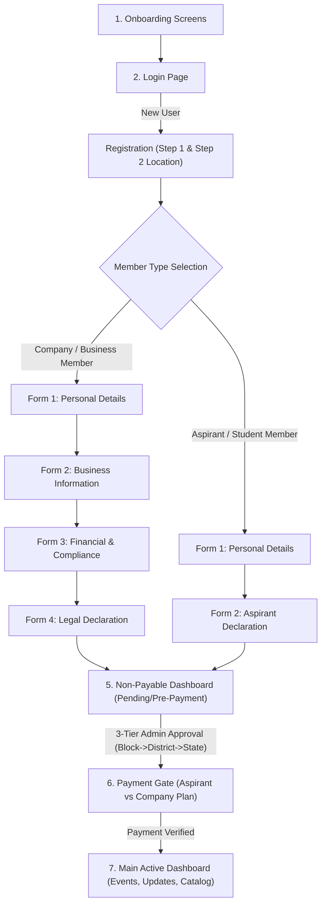

# ACTIV Platform - Customized End-to-End App Workflow & Architecture

This document presents the complete 7-stage user journey for the **ACTIV** platform, detailing every screen transition, data path, conditional logic for **Business Members** vs. **Aspirants (Students)**, pre-payment dashboard states, payment tiers, and the main feature-rich active dashboard.

---

## 🗺️ Master 7-Stage Application Workflow



---

## 1. Stage 1: Onboarding Flow (`OnboardingScreen.tsx`)

- **Screen**: `OnboardingScreen.tsx`
- **Purpose**: Welcomes new and returning users with dynamic carousel slides highlighting core association benefits.
- **Key Features**:
  - Carousel cards: Networking, Business Growth, Regional Associations, Industrial Catalogs.
  - Action Buttons: `Get Started` (navigates to Login/Registration) or `Skip`.

---

## 2. Stage 2: Login Page (`LoginScreen.tsx`)

- **Screen**: `LoginScreen.tsx`
- **Purpose**: Authenticates existing users or redirects new users to registration.
- **Form Controls**:
  - Email input & Password input with show/hide toggle.
  - Validation: Email format check & minimum password length.
- **Social Login Options**: Google, Facebook, LinkedIn integrations.
- **Navigation Routes**:
  - Existing Member → Validates JWT → Navigates to **Dashboard**.
  - New User → Taps "Register as member" → Navigates to **Registration Step 1**.

---

## 3. Stage 3 & 4: Registration & Dual Form Lifecycle

The application automatically branches the registration form lifecycle based on whether the applicant is a **Company Member** or an **Aspirant Member (Student/Individual)**.

```mermaid
graph LR
    subgraph Company Member Pathway (4 Forms)
        C1[1. Personal Details] --> C2[2. Business Info]
        C2 --> C3[3. Financial Compliance]
        C3 --> C4[4. Legal Declaration]
    end

    subgraph Aspirant / Student Pathway (2 Forms)
        A1[1. Personal Details] --> A2[2. Aspirant Declaration]
    end
```

### Path A: Company / Business Member (4 Forms)

1. **Form 1: Personal Details (`PersonalDetailsFormScreen.tsx`)**
   - Full Name, Aadhaar Number, Educational Qualification, Religion, Social Category, City.
2. **Form 2: Business Information (`BusinessInformationFormScreen.tsx`)**
   - Doing Business = `true`
   - Organization Name, Constitution Type (Pvt Ltd, Partnership, Sole Prop, OPC, etc.), Business Categories (Manufacturing, Trader, Service), Commencement Year, Employee Count, Chamber/Govt Memberships.
3. **Form 3: Financial & Compliance (`FinancialComplianceFormScreen.tsx`)**
   - PAN Number, GST Number, Udyam Registration, ITR Filing Status, Annual Turnover Range, Govt Scheme Benefits.
4. **Form 4: Legal Declaration (`DeclarationFormScreen.tsx`)**
   - Sister Concerns details, Company Names List, Legal Undertaking Agreement.

---

### Path B: Aspirant / Student Member (2 Forms)

For student entrepreneurs and aspiring professionals who do not yet own an established business entity:

1. **Form 1: Personal Details (`PersonalDetailsFormScreen.tsx`)**
   - Full Name, Aadhaar/ID, Education Level/Institution, Religion, Social Category, City location.
2. **Form 2: Aspirant Declaration & Goals (`DeclarationFormScreen.tsx`)**
   - Doing Business = `false`
   - Targeted Business Domain, Mentorship/Training Needs, Legal Undertaking Agreement.
   - *Bypasses tax/financial forms (GST, PAN, ITR, Turnover) to make onboarding swift and accessible.*

---

## 5. Stage 5: Non-Payable Pre-Payment Dashboard (`DashboardScreen.tsx`)

Before application approval and payment completion, the user lands on the **Non-Payable Dashboard**.

```
┌────────────────────────────────────────────────────────┐
│               NON-PAYABLE DASHBOARD                    │
├────────────────────────────────────────────────────────┤
│  👤 Welcome, [User Name]                              │
│  📍 Location: [District / Block]                       │
│                                                        │
│  ┌──────────────────────────────────────────────────┐  │
│  │ 📊 Profile Completion Progress: 60%              │  │
│  │ [=========          ]                            │  │
│  │ Action: [Complete Profile Forms]                 │  │
│  └──────────────────────────────────────────────────┘  │
│                                                        │
│  ┌──────────────────────────────────────────────────┐  │
│  │ 💼 Business Account Setup                        │  │
│  │ Create & draft your company profile while under   │  │
│  │ administrative review.                           │  │
│  │ Action: [Create Business Account]                │  │
│  └──────────────────────────────────────────────────┘  │
│                                                        │
│  ┌──────────────────────────────────────────────────┐  │
│  │ ⏳ Application Status: Pending Block Review      │  │
│  │ Your profile is being reviewed by local Admin.  │  │
│  └──────────────────────────────────────────────────┘  │
└────────────────────────────────────────────────────────┘
```

### Key Capabilities in Non-Payable State:
- **Profile Completion Tracker**: Dynamic percentage indicator showing missing form steps.
- **Business Account Setup**: Option to pre-create business logo, description, and catalog drafts.
- **Review Tracking**: Real-time status indicator (`Pending-Block` → `Pending-District` → `Pending-State`).
- *Restricted*: Premium features (Events, Full Directory, Member Contact info) remain locked until payment.

---

## 6. Stage 6: Tiered Membership Payment (`CompleteMembershipScreen.tsx` / `PaymentWebView`)

Once the application receives **State Admin Approval**, the user receives a notification to select their membership plan and complete payment.

### Differentiated Payment Tiers

| Feature / Benefit | Aspirant / Student Plan | Company / Business Plan |
| :--- | :--- | :--- |
| **Target User** | Students, Aspiring Entrepreneurs | Established Businesses & Enterprises |
| **Fee Structure** | Discounted Student Rate | Standard Annual Membership Fee |
| **B2B Directory Listing** | Individual Aspirant Listing | Full Company & Product Showcase |
| **Event Access** | Student Workshops & Events | All General, VIP & Industrial Events |
| **Catalog Capacity** | Up to 2 Draft Ideas | Unlimited Products & Services Listing |

### Payment Process:
1. User selects plan (**Aspirant/Student Plan** or **Company Plan**).
2. App invokes `POST /api/v1/payment/create-order`.
3. Opens integrated Payment Gateway WebView (Razorpay / UPI / NetBanking / Cards).
4. Gateway callback verifies signature (`POST /api/v1/payment/verify`).
5. Status changes from `Pending Payment` to `Active Member`.

---

## 7. Stage 7: Main Active Dashboard (`DashboardScreen.tsx` & `BusinessDashboardScreen.tsx`)

Once payment is verified, the app unlocks the **Full Feature-Rich Dashboard**.

```
┌────────────────────────────────────────────────────────┐
│                 MAIN ACTIVE DASHBOARD                  │
├────────────────────────────────────────────────────────┤
│  👑 PREMIUM ACTIVE MEMBER                              │
│  Welcome back, [Member Name]                           │
├────────────────────────────────────────────────────────┤
│                                                        │
│  📅 UPCOMING EVENTS & UPDATES                          │
│  ┌──────────────────────────────────────────────────┐  │
│  │ 🚀 Annual Industrial Expo 2026                   │  │
│  │ 📍 Convention Center | 🕒 Aug 15, 10:00 AM       │  │
│  │ Action: [Register Event]  [View Details]         │  │
│  └──────────────────────────────────────────────────┘  │
│  ┌──────────────────────────────────────────────────┐  │
│  │ 💡 Student Entrepreneurship Workshop             │  │
│  │ 📍 Innovation Hub     | 🕒 Aug 22, 02:00 PM       │  │
│  └──────────────────────────────────────────────────┘  │
│                                                        │
│  ⏱️ EVENT SCHEDULES & TIMELINE                         │
│  • 10:00 AM - Keynote Address                          │
│  • 11:30 AM - B2B Networking Session                   │
│  • 02:00 PM - Vendor Expo                              │
│                                                        │
│  🚀 QUICK ACCESS SUITE                                 │
│  [💼 Business Suite] [🔍 Member Directory] [📊 Analytics]│
└────────────────────────────────────────────────────────┘
```

### Main Dashboard Features:
1. **Upcoming Events & Association Updates**:
   - Banner sliders for industrial summits, trade expos, and student workshops.
   - Real-time updates from State, District, and Block chapters.
2. **Interactive Event Schedules**:
   - Hourly agendas, speaker schedules, session reminders, and venue directions.
3. **Full Member Directory & B2B Discovery**:
   - Search members and companies by region (State/District/Block) or sector.
4. **Complete Business Suite**:
   - Manage multi-company profiles, product catalogs, stock management, and view analytics.

---

## 8. Summary Checklist of the 7-Step Journey

| Stage | Screen Name | Key Actions |
| :--- | :--- | :--- |
| **1. Onboarding** | `OnboardingScreen.tsx` | View slides, tap Get Started |
| **2. Login** | `LoginScreen.tsx` | Authenticate or switch to Registration |
| **3. Reg Forms (Company)** | `PersonalDetails`, `BusinessInfo`, `Financial`, `Declaration` | 4-step registration for business owners |
| **4. Reg Forms (Aspirant)**| `PersonalDetails`, `Declaration` | 2-step streamlined registration for students |
| **5. Pre-Payment Dash** | `DashboardScreen.tsx` (Pre-payment) | Track profile completion & business draft |
| **6. Payment Gate** | `CompleteMembershipScreen.tsx` | Select Aspirant/Student vs Company Plan |
| **7. Main Dashboard** | `DashboardScreen.tsx` (Active) | Access Events, Schedules, Updates & Business Suite |
