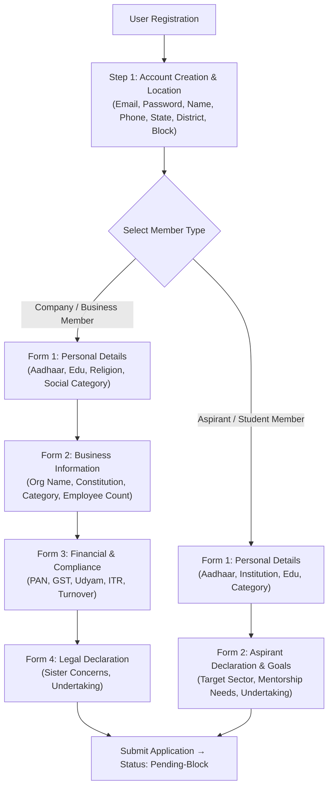
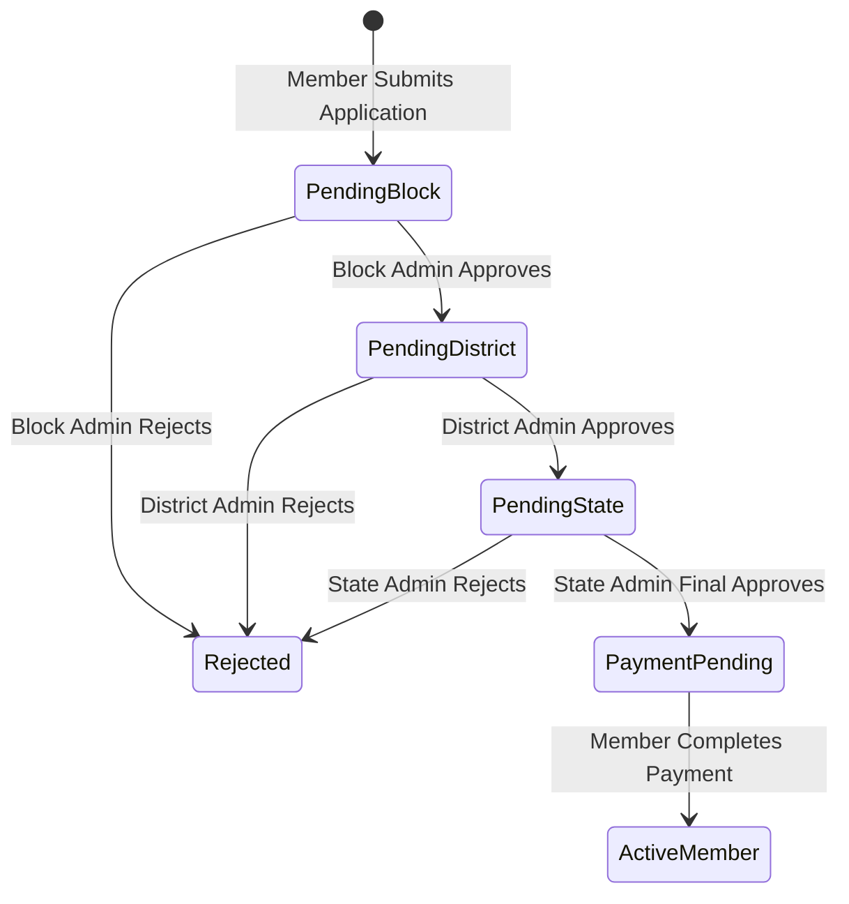

# ACTIV Platform - Master Project Specification & Requirements

This document provides the complete, authoritative specification for rebuilding the **ACTIV Platform** (React Native Mobile Application + Node.js/Express REST Backend API + MongoDB Databases) from scratch in a clean codebase.

---

## 📋 Table of Contents
1. [System Architecture & Core Concepts](#1-system-architecture--core-concepts)
2. [Dual Member Pathways & Registration Logic](#2-dual-member-pathways--registration-logic)
3. [3-Tier Administrative Approval Workflow](#3-tier-administrative-approval-workflow)
4. [Pre-Payment vs Post-Payment Gating Logic](#4-pre-payment-vs-post-payment-gating-logic)
5. [Complete Database Schema Specification (MongoDB Data Dictionary)](#5-complete-database-schema-specification)
6. [Frontend Screen Catalog & UI Architecture (React Native)](#6-frontend-screen-catalog--ui-architecture)
7. [Backend REST API Specification](#7-backend-rest-api-specification)
8. [Recommended Project Setup & Clean Directory Layout](#8-recommended-project-setup--clean-directory-layout)

---

## 1. System Architecture & Core Concepts

### Architecture Diagram

```mermaid
graph TD
    Mobile["📱 React Native Mobile App\n(iOS & Android)"]
    API["⚡ Node.js / Express REST API\n(Port 5000)"]
    
    subgraph Data Tier (MongoDB)
        MembersDB[("storage: membersdb\n(Auth, Profiles, Products, Applications, Payments)")]
        AdminsDB[("storage: adminsdb\n(Block, District, State, Super Admins)")]
    end

    Mobile <-->|"REST Calls / Bearer JWT"| API
    API <--> MembersDB
    API <--> AdminsDB
```

### Core System Pillars
1. **Multi-Role User Ecosystem**:
   - **Aspirant / Student Member**: Aspiring entrepreneurs bypass business/tax compliance forms.
   - **Company / Business Member**: Full business owner registration with GST/PAN/ITR verification.
   - **Block Admin**: Reviews applications registered in their designated block/taluk.
   - **District Admin**: Reviews block-approved applications within their district.
   - **State Admin**: Final approval authority to unlock membership payment link.
   - **Super Admin**: System-wide platform metrics, role assignment, and audit reporting.

---

## 2. Dual Member Pathways & Registration Logic

Registration is divided into two distinct member pathways:



---

## 3. 3-Tier Administrative Approval Workflow

Applications must pass through a strict sequential 3-tier approval hierarchy before membership payment is permitted.



---

## 4. Pre-Payment vs Post-Payment Gating Logic

| Feature / Screen | Non-Payable Dashboard (Pending / Approved-Unpaid) | Active Paid Dashboard (Paid Member) |
| :--- | :--- | :--- |
| **Profile Completion Tracker** | ✅ Visible (Shows form progress) | ❌ Hidden (Completed) |
| **Draft Company Profile** | ✅ Allowed (Prepare profile details) | ✅ Full Access (Manage live details) |
| **Application Status Widget** | ✅ Live tracking (Pending-Block/District/State) | ❌ Replaced by Active Badge |
| **Events & Schedules Catalog** | 🔒 Locked / Read-Only Banners | ✅ Full Event Registration & Agendas |
| **Member Directory / B2B Search** | 🔒 Restricted | ✅ Direct Member Connect & Directory |
| **Product Showcase & Stock** | 🔒 Read-Only Draft | ✅ Live Publishing & Direct B2B Inquiries |

---

## 5. Complete Database Schema Specification

The backend uses MongoDB with two separate databases: `membersdb` and `adminsdb`.

### 5.1 `membersdb` Collections

#### Collection: `memberauths`
```json
{
  "_id": "ObjectId",
  "email": "String (Required, Unique, Lowercase, Trim)",
  "password": "String (Required, Hashed with bcryptjs)",
  "role": "String (Default: 'member')",
  "isActive": "Boolean (Default: true)",
  "lastLogin": "Date",
  "createdAt": "Date (Timestamp)",
  "updatedAt": "Date (Timestamp)"
}
```

#### Collection: `memberdetails`
```json
{
  "_id": "ObjectId",
  "memberId": "ObjectId (Ref: memberauths, Required, Unique)",
  "fullName": "String (Required)",
  "email": "String (Required)",
  "phoneNumber": "String (Required)",
  "state": "String (Required)",
  "district": "String (Required)",
  "block": "String (Required)",
  "city": "String",
  "aadhaarNumber": "String (Masked/Encrypted)",
  "educationalQualification": "String",
  "religion": "String",
  "socialCategory": "String",
  "memberType": "String (Enum: ['company', 'aspirant'])",
  "membershipStatus": "String (Enum: ['pending', 'approved', 'rejected', 'active', 'expired'], Default: 'pending')",
  "membershipType": "String (Enum: ['none', 'aspirant', 'company'], Default: 'none')",
  "profileCompleted": "Boolean (Default: false)",
  "approvedBy": "ObjectId (Ref: stateadmins)",
  "approvedAt": "Date",
  "createdAt": "Date",
  "updatedAt": "Date"
}
```

#### Collection: `memberbusinessinfos`
```json
{
  "_id": "ObjectId",
  "memberId": "ObjectId (Ref: memberauths, Required, Unique)",
  "doingBusiness": "Boolean (Default: true)",
  "organizationName": "String",
  "constitutionType": "String (Propriorship, Partnership, Pvt Ltd, Public Ltd, OPC, LLP)",
  "businessCategories": ["String"],
  "commencementYear": "Number",
  "numberOfEmployees": "Number",
  "memberships": ["String"],
  "businessWebsite": "String",
  "status": "String (Enum: ['draft', 'submitted', 'approved'], Default: 'draft')"
}
```

#### Collection: `memberfinancialinfos`
```json
{
  "_id": "ObjectId",
  "memberId": "ObjectId (Ref: memberauths, Required, Unique)",
  "panNumber": "String (Uppercase)",
  "gstNumber": "String (Uppercase)",
  "udyamNumber": "String",
  "filedITR": "Boolean",
  "turnoverRange": "String",
  "govtSchemeBenefit": "Boolean",
  "schemeDetails": "String"
}
```

#### Collection: `memberdeclarations`
```json
{
  "_id": "ObjectId",
  "memberId": "ObjectId (Ref: memberauths, Required, Unique)",
  "hasSisterConcerns": "Boolean",
  "companyNames": ["String"],
  "targetBusinessDomain": "String (For Aspirants)",
  "mentorshipNeeds": ["String"],
  "agreeToDeclaration": "Boolean (Required: true)",
  "declarationDate": "Date"
}
```

#### Collection: `applications`
```json
{
  "_id": "ObjectId",
  "userId": "ObjectId (Ref: memberauths, Required)",
  "fullName": "String (Required)",
  "email": "String (Required)",
  "phone": "String (Required)",
  "state": "String (Required)",
  "district": "String (Required)",
  "block": "String (Required)",
  "status": "String (Enum: ['Pending-Block', 'Pending-District', 'Pending-State', 'Approved', 'Rejected'], Default: 'Pending-Block')",
  "assignedBlockAdmin": "ObjectId (Ref: blockadmins)",
  "assignedDistrictAdmin": "ObjectId (Ref: districtadmins)",
  "assignedStateAdmin": "ObjectId (Ref: stateadmins)",
  "blockApprovedAt": "Date",
  "districtApprovedAt": "Date",
  "stateApprovedAt": "Date",
  "rejectedBy": {
    "adminId": "ObjectId",
    "adminType": "String",
    "rejectedAt": "Date",
    "reason": "String"
  },
  "notes": [
    {
      "adminId": "ObjectId",
      "adminType": "String",
      "note": "String",
      "createdAt": "Date"
    }
  ],
  "documents": [
    {
      "name": "String",
      "url": "String",
      "type": "String"
    }
  ]
}
```

#### Collection: `companies`
```json
{
  "_id": "ObjectId",
  "ownerId": "ObjectId (Ref: memberauths, Required)",
  "name": "String (Required)",
  "tagline": "String",
  "description": "String",
  "logoUrl": "String",
  "bannerUrl": "String",
  "category": "String (Required)",
  "email": "String",
  "phone": "String",
  "address": {
    "street": "String",
    "city": "String",
    "state": "String",
    "pincode": "String"
  },
  "isVerified": "Boolean (Default: false)"
}
```

#### Collection: `products`
```json
{
  "_id": "ObjectId",
  "companyId": "ObjectId (Ref: companies, Required)",
  "ownerId": "ObjectId (Ref: memberauths, Required)",
  "name": "String (Required)",
  "description": "String",
  "category": "String (Required)",
  "price": "Number",
  "priceUnit": "String (e.g. per piece, per meter, per kg)",
  "imageUrl": "String",
  "status": "String (Enum: ['active', 'inactive'], Default: 'active')",
  "createdAt": "Date"
}
```

---

### 5.2 `adminsdb` Collections

#### Collections: `blockadmins`, `districtadmins`, `stateadmins`, `superadmins`
```json
{
  "_id": "ObjectId",
  "adminId": "String (Required, Unique, e.g. BA0001, DA0001, SA0001)",
  "email": "String (Required, Unique)",
  "password": "String (Hashed)",
  "fullName": "String (Required)",
  "role": "String ('block_admin' | 'district_admin' | 'state_admin' | 'super_admin')",
  "state": "String (Assigned jurisdiction)",
  "district": "String (Assigned jurisdiction, empty for State/Super)",
  "block": "String (Assigned jurisdiction, empty for District/State/Super)",
  "isActive": "Boolean (Default: true)"
}
```

---

## 6. Frontend Screen Catalog & UI Architecture

### 6.1 Authentication & Onboarding
- **`OnboardingScreen.tsx`**: Dynamic onboarding slider showcasing networking, industrial catalogs, and membership perks.
- **`LoginScreen.tsx`**: Email/Password authentication with toggles and redirect links.
- **`ForgotPasswordScreen.tsx`**: Password recovery and OTP email request.
- **`WelcomeScreen.tsx`**: Landing screen with CTA buttons for Login vs Register.

### 6.2 Registration Flow
- **`RegistrationStep1Screen.tsx`**: Initial registration capturing credentials (email, password, full name, phone) and Location Hierarchy selectors (State -> District -> Block).
- **`RegistrationStep2Screen.tsx`**: Dynamic multi-form hub:
  - Selects pathway (**Company Owner** vs **Aspirant/Student**).
  - Renders progressive forms (Personal Details, Business Info, Financial Compliance, Legal Declaration).

### 6.3 Member & Business Hub
- **`DashboardScreen.tsx`**: Dynamic dual-state dashboard (Switches automatically between **Non-Payable Pre-payment view** and **Active Paid Member view**).
- **`ProfileScreen.tsx` / `EditProfileScreen.tsx`**: Comprehensive view and edit screen for personal details and application documents.
- **`BusinessDashboardScreen.tsx`**: Business overview screen showcasing company stats, product catalog shortcuts, and inquiry counters.
- **`BusinessProfileScreen.tsx` / `AddCompanyScreen.tsx` / `EditCompanyScreen.tsx`**: Business management suite to create and edit registered companies.
- **`ProductsServicesScreen.tsx` / `AddProductScreen.tsx`**: Catalog creation and inventory management screen.
- **`DiscoverScreen.tsx`**: B2B search engine with state/district filters to search registered members and business catalogs.
- **`NotificationScreen.tsx`**: System notifications for approval status updates and event invitations.
- **`SettingsScreen.tsx`**: User preferences, account security, and logout.

### 6.4 Application & Payment Gating
- **`ApplicationStatusScreen.tsx`**: Interactive timeline tracking Block, District, and State admin approval timestamps and comments.
- **`ApplicationSubmittedScreen.tsx`**: Confirmation screen after form submission.
- **`CompleteMembershipScreen.tsx`**: Tiered plan selection screen (**Aspirant Plan** vs **Company Business Plan**) leading to integrated Payment Gateway.
- **`PaymentSuccessScreen.tsx`**: Order receipt and congratulatory layout with button to unlock Main Dashboard.

### 6.5 Admin Management Dashboards
- **`BlockAdminDashboardScreen.tsx`**: Review pending block applications, verify uploaded documents, approve/forward to District or reject with reason.
- **`DistrictAdminDashboardScreen.tsx`**: Review block-approved applications, approve/forward to State or reject.
- **`StateAdminDashboardScreen.tsx`**: Final review portal to approve application and issue membership payment link.
- **`SuperAdminDashboardScreen.tsx`**: Master telemetry screen displaying user stats, revenue, admin account management, and system logs.
- **`UserManagementScreen.tsx`**: Admin tool to manage, activate, deactivate, or upgrade user accounts.
- **`ReportsScreen.tsx` / `AnalyticsScreen.tsx`**: Exportable administrative report generator.

---

## 7. Backend REST API Specification

### Base URL: `http://localhost:5000/api`
All protected endpoints require HTTP Header: `Authorization: Bearer <JWT_TOKEN>`

### 7.1 Auth Routes (`/api/auth`)
| Method | Endpoint | Access | Description |
| :--- | :--- | :--- | :--- |
| `POST` | `/api/auth/register` | Public | Register new member and initialize profile |
| `POST` | `/api/auth/login` | Public | Authenticate user & return JWT token |
| `GET` | `/api/auth/me` | Protected | Fetch authenticated user context |
| `POST` | `/api/auth/admin/login` | Public | Authenticate Block/District/State/Super Admin |

### 7.2 Member Profile Routes (`/api/members`)
| Method | Endpoint | Access | Description |
| :--- | :--- | :--- | :--- |
| `GET` | `/api/members/profile` | Member | Fetch aggregate member profile details |
| `PUT` | `/api/members/details` | Member | Update Form 1 (Personal details) |
| `PUT` | `/api/members/business-info` | Member | Update Form 2 (Business details) |
| `PUT` | `/api/members/financial-info` | Member | Update Form 3 (Financial & tax details) |
| `PUT` | `/api/members/declaration` | Member | Update Form 4 (Legal declaration) |
| `GET` | `/api/members/discover` | Active Member | Search directory with location/category filters |

### 7.3 Application Routes (`/api/applications`)
| Method | Endpoint | Access | Description |
| :--- | :--- | :--- | :--- |
| `POST` | `/api/applications` | Member | Submit membership application |
| `GET` | `/api/applications/my-applications` | Member | List current user application history |
| `GET` | `/api/applications/:id` | Member/Admin | View detailed application state |

### 7.4 Tiered Admin Approval Routes (`/api/admin`)
| Method | Endpoint | Access | Description |
| :--- | :--- | :--- | :--- |
| `GET` | `/api/admin/block/applications` | Block Admin | List applications pending block approval |
| `POST` | `/api/admin/block/applications/:id/approve` | Block Admin | Approve application -> forward to District |
| `POST` | `/api/admin/block/applications/:id/reject` | Block Admin | Reject application with reason |
| `GET` | `/api/admin/district/applications` | District Admin | List applications pending district approval |
| `POST` | `/api/admin/district/applications/:id/approve` | District Admin | Approve application -> forward to State |
| `GET` | `/api/admin/state/applications` | State Admin | List applications pending state approval |
| `POST` | `/api/admin/state/applications/:id/approve` | State Admin | Final approve application -> unlock payment |
| `GET` | `/api/admin/super/analytics` | Super Admin | Fetch global system analytics & stats |

### 7.5 Payment Gateway Routes (`/api/payment`)
| Method | Endpoint | Access | Description |
| :--- | :--- | :--- | :--- |
| `POST` | `/api/payment/create-order` | Approved Member | Generate Razorpay / Gateway order token |
| `POST` | `/api/payment/verify` | Approved Member | Verify transaction signature & activate membership |
| `POST` | `/api/payment/webhook` | Public | Asynchronous gateway payment notification listener |

---

## 8. Recommended Project Setup & Clean Directory Layout

When starting your clean codebase, use the following clean directory organization:

### Backend Structure (`activ-backend/`)
```
activ-backend/
├── src/
│   ├── config/
│   │   ├── db.js             # Dual Mongoose connection handlers (membersdb & adminsdb)
│   │   └── env.js            # Environment variable validation
│   ├── core/
│   │   ├── middleware/
│   │   │   ├── auth.middleware.js     # JWT verification middleware
│   │   │   ├── error.middleware.js    # Global exception handling middleware
│   │   │   └── role.middleware.js     # RBAC (Role-based access control)
│   │   └── utils/
│   │       ├── apiResponse.js         # Standard JSON response structure helper
│   │       └── logger.js              # Server logger
│   ├── models/
│   │   ├── admin.model.js
│   │   ├── application.model.js
│   │   ├── company.model.js
│   │   ├── member.model.js
│   │   └── product.model.js
│   ├── modules/
│   │   ├── admin/
│   │   ├── applications/
│   │   ├── auth/
│   │   ├── members/
│   │   └── payment/
│   ├── app.js               # Express application initialization
│   ├── routes.js            # Central API route hub
│   └── server.js            # Server entrypoint listener
├── .env.example
└── package.json
```

### Mobile Frontend Structure (`Activ/`)
```
Activ/
├── src/
│   ├── assets/              # Logos, onboarding banners, icons
│   ├── components/          # Reusable UI elements (Custom Input, Buttons, Cards, Header)
│   ├── config/              # Constants, API endpoints, App config
│   ├── context/             # AuthContext, ThemeContext, ApplicationContext
│   ├── navigation/          # React Navigation stacks & tab bars
│   │   ├── AppNavigator.tsx
│   │   ├── AuthNavigator.tsx
│   │   ├── AdminNavigator.tsx
│   │   └── MainTabNavigator.tsx
│   ├── screens/
│   │   ├── admin/           # Admin dashboards
│   │   ├── application/     # Status & submission screens
│   │   ├── auth/            # Login, Onboarding, Register
│   │   ├── business/        # Business profile, Add Company, Products
│   │   ├── member/          # Dashboard, Profile, Member directory
│   │   ├── payment/         # Plan selector & Payment success
│   │   └── registration/    # Multi-step registration wizard
│   ├── services/            # Axios API client functions & AsyncStorage helpers
│   ├── types/               # TypeScript interfaces & types
│   └── utils/               # Form validators, currency formatters
├── App.tsx                  # Application entry point
└── package.json
```

### Recommended Environment Variables (`.env`)
```env
PORT=5000
NODE_ENV=development
MEMBERS_DB_URI=mongodb://localhost:27017/membersdb
ADMINS_DB_URI=mongodb://localhost:27017/adminsdb
JWT_SECRET=your_super_secret_jwt_key_here
JWT_EXPIRES_IN=7d
RAZORPAY_KEY_ID=rzp_test_xxxxxx
RAZORPAY_KEY_SECRET=xxxxxxx
```

---
*Generated for clean codebase re-architecture of ACTIV Platform.*
